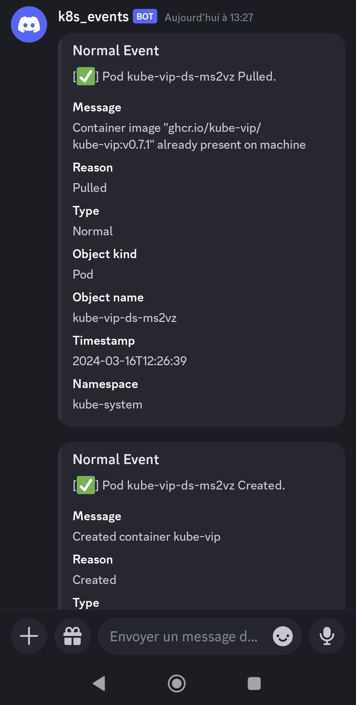

# Kube Notify


[](https://github.com/pre-commit/pre-commit)


An app that watches kubernetes resource creation, deletion, updates and errors events and notify selected events to gotify.

## Screenshots

| Gotify | Discord |
|--------|---------|
|   |  |

## Installation

`Kube-notify`

1. Create and modify configuration file :

```sh
cp config.sample.yaml config.yaml
vim config.yaml
kubectl create cm kube-notify-config -n monitoring --from-file config.yaml
```

2. Deploy resources (deployement + rbac) in `monitoring` namespace :

```sh
kubectl apply -f deployement.yaml
```

## Configuration

All configuration are in `/app/config.yaml` file.
Use [sample config](./config.sample.yaml) as an example.

## To do

- [ ] Optimize Code
- [ ] Badges
  - [x] Latest release
  - [x] CI passing
  - [x] License
  - [ ] Coverage
- Fonctionnalities
  - [x] Stream CoreAPI Events
  - [x] Possibility to stream Velero backups
  - [x] Filter notifications on the following criteria : types, reasons, labels, namespaces, involvedObjectKind
  - [ ] Track Pod termination reasons
  - [ ] Add OpenAI module to send recomendation messages for non-normal events.
- [ ] Create Helm chart
- [ ] Documenting
  - [x] Installation
  - [ ] Configuration
- [ ] Notification services
  - [x] Discord
  - [x] Gotify
  - [x] Mattermost
  - [ ] Slack
  - [ ] Telegram
- [ ] Automation (GitHub Actions)
  - [ ] Coverage tests
  - [x] pre-commit
  - [x] Trivy security scan
  - [x] Docker build & push (latest + releases)

## References

- [kubernetes_asyncio](https://github.com/tomplus/kubernetes_asyncio)
- [Link to the corresponding docker image](https://hub.docker.com/r/wikle/kube-notify)
